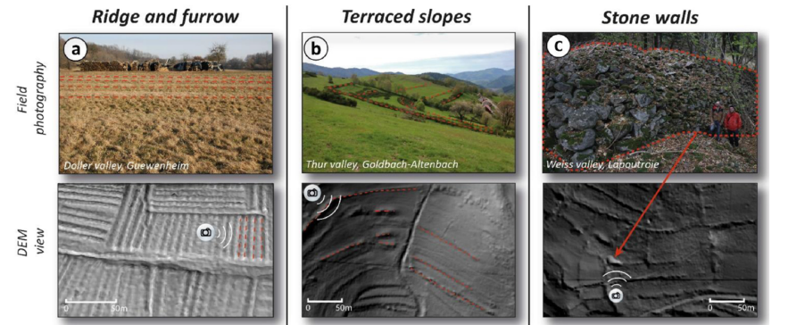

# Former Field Systems Workshop  
📅 **24–26 September 2025**  
📍 **Strasbourg, France**

---

## Introduction

Either you dig it or you map it, whether you're interested in the **history of agricultural landscapes**, **historical ecology**, **palaeopedology**, or **geomorphology**…  
Whether you're a **master's student** or a **senior researcher**, you're welcome to take part in the **FFS 2025 Workshop** in Strasbourg.

  
*Examples of former field systems from Keller et al. (2023).*

---

## General Information

- **📧 Registration:** Free (limited to 20 participants) – send an email to [damien.ertlen@live-cnrs.unistra.fr](mailto:damien.ertlen@live-cnrs.unistra.fr)  
  *Deadline: 25 August 2025*
- **🍽 Meals included:** Lunches on Wednesday, Thursday, Friday + Dinner on Thursday
- **🏢 Host Laboratory:**  
  LIVE (Laboratoire Image, Ville, Environnement)  
  Université de Strasbourg, CNRS – [Landscape Dynamics Group](https://live.unistra.fr/recherches/dynamique-des-paysages-geoarcheologie-quaternaire)

**Organizing Committee:**  
- Eileen Eckmeier, Kiel University  
- Barbora Strouhalova, Charles University Prague  
- Damien Ertlen, Strasbourg University  
- Benjamin Keller, Strasbourg University  

---

## Table of Contents

1. [Detailed Program](#detailed-program)  
2. [List of Participants](#list-of-participants)  
3. [FFS in Your Own Language / Multilingual Glossary](#ffs-in-your-own-language--multilingual-glossary)  
4. [Mapathon](#mapathon)  
5. [Bibliography](#bibliography)  

---

## Detailed Program

### 🗓 Wednesday, 24 September

📍 *Faculté de Géographie et d’Aménagement*,  
3 rue de l’Argonne, 67000 Strasbourg  
**Tram stop:** Observatoire (Lines C, E, F – direct from train station)

- **12:15** Lunch – Restaurant l’Observatoire (1 Rue Kirstein)
- **13:30** Welcome coffee (Room 011, Ground floor)
- **13:45** Workshop Introduction – *D. Ertlen*

#### Presentations

| Time  | Presenter                  | Title |
|-------|----------------------------|-------|
| 14:10 | Alexander BONHAGE          | *Historic Raised Beds in NW Ireland: Remote Sensing and Soil Properties* |
| 14:30 | Barbora STROUHALOVA        | *Forgotten Forest Activities in Sumava NP, Czech Republic* |
| 14:50 | Nathanael LE VOGUER        | *2000 Years of the Beauce Landscape through Headland Field Boundaries* |
| 15:10 | Eileen KERHOUANT           | *Inherited Landscapes: Roman Presence in Homs Basalt Region* |
| 15:30 | Emma BORG                  | *Ackerberg in the Rhine Graben, France* |
| 15:50 | Benjamin KELLER            | *Mapping & Digging Ridge and Furrows in Alsace* |
| 16:10 | ☕ Coffee Break             | |
| 16:30 | Anna SCHNEIDER             | *Former Field Systems in Upper Palatinate Forests* |
| 16:50 | Antonin NUSSLEIN & Murielle GEORGES-LEROY | *Fossilised Agricultural Landscapes (Meuse–Rhine)* |
| 17:10 | Juraj LISKOVSKY            | *Traditional Agricultural Landscapes in Slovakia* |
| 17:30 | Václav FANTA (TBC)         | *Historical Field Systems: Culture & Environment Interaction (Czech Rep.)* |
| 18:30 | 🧊 Icebreaker              | Free time in town |

---

### 🗓 Thursday, 25 September

- **08:45** ☕ Coffee  
- **09:00 – 09:45** Mapathon Instructions (with master students)  
- **10:00 – 13:00** 🗺 **MAPATHON**  
- **13:00 – 14:30** 🥪 Lunch (picnic at the faculty)  
- **14:30 – 15:30** Mapathon Discussion: methodology, insights, next steps  
- **15:30** Presentation of existing Alsace database – *Keller, Borg, Ertlen*  
- **16:00 – 17:00** Group Discussion: Building a Common Database – Is it needed?

🍽 **20:15 Dinner** – Restaurant *La Fignette*, 5 Rue de la Vignette, Strasbourg

---

### 🗓 Friday, 26 September

- **08:45** ☕ Coffee  
- **09:00 – 12:00** Group Discussion:  
  - Project of a review publication (Central Europe)
  - Definition of:  
    - Research questions  
    - Study area  
    - Strategy  

---

## List of Participants

| Name | Institution | Email |
|------|-------------|-------|
| **Dr. Alexander BONHAGE** | BTU Cottbus-Senftenberg, Germany | [alexander.bonhage@b-tu.de](mailto:alexander.bonhage@b-tu.de) |
| **Emma BORG** | Master student, Université de Strasbourg | [emma.borg2@etu.unistra.fr](mailto:emma.borg2@etu.unistra.fr) |
| **Prof. Dr. Eileen ECKMEIER** | CAU zu Kiel, Germany | [eeckmeier@ecology.uni-kiel.de](mailto:eeckmeier@ecology.uni-kiel.de) |
| **Dr. Damien ERTLEN** | Université de Strasbourg | [damien.ertlen@live-cnrs.unistra.fr](mailto:damien.ertlen@live-cnrs.unistra.fr) |
| **Dr. Václav FANTA** | Czech Univ. of Life Sciences Prague | [fantav@fzp.czu.cz](mailto:fantav@fzp.czu.cz) |
| **Dr. Pierre-Alexis HERRAULT** | Université de Strasbourg | [pierre-alexis.herrault@live-cnrs.unistra.fr](mailto:pierre-alexis.herrault@live-cnrs.unistra.fr) |
| **Dr. Benjamin KELLER** | Université de Strasbourg / CNRS | [benjamin.keller@live-cnrs.unistra.fr](mailto:benjamin.keller@live-cnrs.unistra.fr) |
| **Eileen KERHOUANT** | Durham University, UK | [ekerhouant@gmail.com](mailto:ekerhouant@gmail.com) |
| **Dr. Nathanael LE VOGUER** | UMR 7324 CITERES-LAT, France | [nathanael.levoguer@univ-tours.fr](mailto:nathanael.levoguer@univ-tours.fr) |
| **Dr. Juraj LISKOVSKY** | Slovak Academy of Sciences | [juraj.lieskovsky@savba.sk](mailto:juraj.lieskovsky@savba.sk) |
| **Dr. Antonin NUSSLEIN** | CNRS, Strasbourg | [nusslein@unistra.fr](mailto:nusslein@unistra.fr) |
| **Dr. Anna SCHNEIDER** | BTU Cottbus-Senftenberg, Germany | [anna.schneider@b-tu.de](mailto:anna.schneider@b-tu.de) |
| **Dr. Barbora STROUHALOVA** | Charles University, Prague | [barbora.strouhalova@natur.cuni.cz](mailto:barbora.strouhalova@natur.cuni.cz) |
| **Prof. Dr. Dimitrij Mlekuž VRHOVNIK** | University of Ljubljana, Slovenia | [dimitrij.mlekuz@ff.uni-lj.si](mailto:dimitrij.mlekuz@ff.uni-lj.si) |

---

## FFS in Your Own Language / Multilingual Glossary

*Coming soon.*

---

## Mapathon

*Details on methodology, tools used, and results will be added after the event.*

---

## Bibliography

*Relevant references and shared papers will be provided soon.*

---
